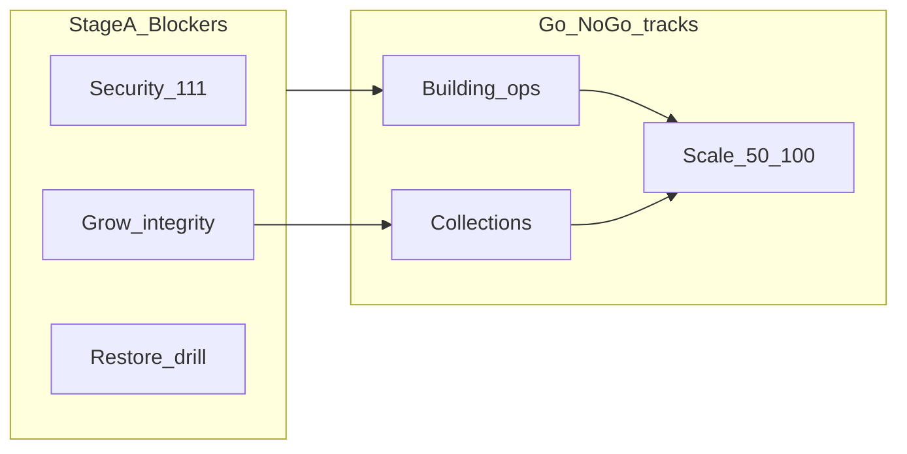

# BINO — תוכנית תיקון מוכנות להתרחבות (2026-10-03)

**סטטוס:** תכנון מאושר לביצוע מדורג — מסמך זה אינו מיישם שינויים.  
**מקור ממצאים:** [`BINO_PAYING_CUSTOMERS_READINESS_AUDIT_HE_2026-10-03.md`](./BINO_PAYING_CUSTOMERS_READINESS_AUDIT_HE_2026-10-03.md)  
**קוד שנאמת מולו:** `main` @ `da9fcb3` · סכמת Bamakor כפי שנמדדה בביקורת (מיגרציות 111/112/113 לא הוחלו)

---

## 1. מטרה

להגיע למערכת שאפשר לצרף אליה לקוחות משלמים בביטחון, עם **ראיות** למוכנות — לא רק CI ירוק.

שלושה מסלולי Go/No-Go נפרדים:

| מסלול | מה נדרש | לא מספיק |
|--------|---------|----------|
| **ניהול בניינים** | אבטחת tenant, הרשאות תפקידים, smoke תקלות, restore מוכח, מדידת nav/PWA אחרי login | TTFB של דפים ציבוריים |
| **גבייה** | כל תנאי בניינים + idempotency + תיקוני Grow + חקירת חריגות מול Grow + E2E sandbox (+ חשבונית אם נמכרת) | «יש כמה paid=ok בהיסטוריה» |
| **עומס 50–100** | מדידות authenticated, אינדקסים/IO, עלויות הודעות, תקרת AI | עומס נוכחי של 2 לקוחות |

---

## 2. אימות ממצאים מול קוד וסכמה

| ממצא | סטטוס | הערה |
|------|--------|------|
| B1 / H1 — מיגרציה 111 | **פתוח בפרוד** | SQL בריפו; REVOKE + UNIQUE לא הוחלו ב־Bamakor |
| B2 — מיגרציה 113 | **פתוח בפרוד** | קוד כותב `idempotency_key`; עמודה חסרה בפרוד |
| H8 — מיגרציה 112 | **פתוח בפרוד / קוד מוכן** | `delete-project` כבר soft-delete; `deleted_at` חסר בפרוד |
| B3 — paid בלי approve | **פתוח (נתונים)** | 4 שורות; אין לתקן ב«איפוס» |
| B4 — E2E Grow | **פתוח (תהליך)** | |
| B5 — restore | **פתוח (ops)** | **בתוכנית זו: שלב א׳** (נסגרה סתירה מול דחייה לשלב ב׳ בדוח) |
| H2 / H3 / M2 / M3 — Grow webhook | **פתוח בקוד** | |
| H5 / M9 — הרשאות / UX | **פתוח בקוד** | |
| M1 — `bamakor_my_client_ids` | **פתוח** | ללא סינון `is_active` ב־`028_…sql` |
| H4 — `system_logs` | **פתוח בפרוד** | מיגרציה `033` בריפו; טבלה לא קיימת ב־Bamakor |
| H7 — deps | **פתוח** | `next@16.2.1` → תיקון זמין `≥16.3.8`; `xlsx@0.18.5` ללא fix ב־npm |
| כתיבות דפדפן לטבלאות 111 | **לא נמצאו** | כל המוטציות דרך API + `getSupabaseAdmin()` — מפחית סיכון שבירת UI אחרי REVOKE |

### סתירת B5 (שחזור)

בדוח הביקורת: חומרת חוסם, אך סדר טיפול ישן דחה restore לשלב ב׳.  
**החלטת תוכנית:** תרגיל שחזור עם RTO/RPO ומיפוי מה ניתן לשחזור הוא **משימה A9 בשלב א׳**. שיפורי ניטור משניים (Sentry polish, cadence) נשארים בשלב ב׳.

---

## 3. החלטות Owner — סטטוס רישום

סעיף זה מתעד מה **חסר מה־owner** לפני/במהלך הביצוע. עד לקבלת תשובות — הסטטוס הוא **ממתין**.

| # | החלטה נדרשת | סטטוס | ברירת מחדל בתוכנית עד החלטה |
|---|-------------|--------|------------------------------|
| D1 | אישור apply מיגרציות 111 / 112 / 113 (+ `system_logs`) ל־Bamakor | **ממתין** | אין apply בלי אישור מפורש |
| D2 | גישת Grow sandbox + טננט בדיקה ייעודי (לא לקוח חי) | **ממתין** | Go גבייה חסום בלי זה |
| D3 | מדיניות ל־4 החיובים אחרי סיווג מול Grow (תיעוד בלבד / תיקון ידני חשבונאי — **לא** auto-approve) | **ממתין** | חקירה (A4) בלי שינוי סטטוס |
| D4 | משתמשי בדיקה דו־ארגוניים (admin/manager/viewer/worker/resident) | **ממתין** | A7 על test env בלבד |
| D5 | האם PITR פעיל ב־Bamakor והיכן לבצע restore drill | **ממתין** | Local dump/restore או פרויקט בדיקה — **לא** Supabase preview בתשלום |
| D6 | לקוח הבא: בניינים-בלבד תחילה, או גם גבייה/חשבוניות | **ממתין** | מומלץ: Go בניינים לפני Go גבייה |
| D7 | דחיית MFA סופר־אדמין (M5) ו/או חתימת `/report` (M11) | **ממתין** | בלי אישור דחייה — נשארים בשלב ב׳ כחובה לפני scale |

**עדכון סטטוס:** לאחר תשובת owner — לעדכן טבלה זו ב־PR המשך (docs) או בהערה ב־PR יישום.

---

## 4. סדר ביצוע מומלץ (תמצית)

1. **A1 prep** — ניקוי כפילויות WA + checklist REVOKE (כבר אומת: אין DML דפדפן).  
2. **A1 + A3 + A8** — apply 111 / 112 / `system_logs` (אחרי D1).  
3. **A6** — WriteAccess + UI צופה → **A7** מטריצת הרשאות (אחרי D4).  
4. **A2** — apply 113 + idempotency bulk/webhook (לפני גבייה).  
5. **A4** חקירת 4 חיובים (D2/D3) במקביל ל־**A5** תיקוני Grow.  
6. **A9** תרגיל restore (D5) — חוסם Go בניינים.  
7. **A11** smoke בניינים → **Go ניהול בניינים** (אם D6 = בניינים בלבד).  
8. **A10** E2E Grow sandbox → **Go גבייה**.  
9. שלב ב׳ (ביצועים/PWA, false-success, CI routes, deps, אינדקסים…).  
10. שלב ג׳ לפני 50–100 לקוחות.

**מאמץ כולל (סדר גודל):** שלב א׳ ~15–25 ימי־עבודה · שלב ב׳ ~12–20 · שלב ג׳ ~8–15 (מתמשך).  
אי־ודאות עיקרית: D1–D5, זמן חקירת החיובים, ואימות תשובת Approve מול Grow.

---

## 5. שלב א׳ — חוסמי אבטחה, כסף, אובדן נתונים

### A1 — מיפוי כתיבות + Apply מיגרציה 111 (B1, H1)

| שדה | פירוט |
|-----|--------|
| **1. ממצא / סיכון** | `authenticated` יכול לכתוב ישירות ל־PostgREST על tickets/residents/charges וכו׳; אין UNIQUE על `whatsapp_phone_number_id` — עקיפת API + השבתת WhatsApp בעמימות |
| **2. שינוי** | Apply [`supabase/migrations/111_audit_whatsapp_phone_unique_and_rls_writes.sql`](../supabase/migrations/111_audit_whatsapp_phone_unique_and_rls_writes.sql). לפני: שאילתת כפילויות WA; checklist — אין `.insert/.update/.delete` מדפדפן (אומת בביקורת). משלים: אם `nfc_tags`≠`worker_nfc_tags` — מיגרציה נוספת עם `REVOKE` על `worker_nfc_tags`. רענון `lib/database.types.ts` |
| **3. תלות** | לפני apply: ניקוי כפילויות. אחרי: A7. מקביל אפשרי ל־A3/A8 |
| **4. מאמץ / אי־ודאות** | S–M · REVOKE: נמוכה · UNIQUE: בינונית אם יש כפילויות |
| **5. בדיקות / קבלה** | `has_table_privilege(...,'INSERT')=false`; PostgREST PATCH → 401/403; API assign/update/create עובדים; UNIQUE מונע שני clients עם אותו phone_number_id |
| **6. פריסה / rollback** | SQL בשעות שקטות (D1). Rollback מתועד: `GRANT INSERT,UPDATE, DELETE` לטבלאות + `DROP INDEX` במידת הצורך |
| **7. חסר** | D1; גישת apply |

### A2 — Apply 113 + Idempotency מורחב (B2 + bulk/webhook/מקביליות)

| שדה | פירוט |
|-----|--------|
| **1. ממצא / סיכון** | כפילות חיובים ב־retry; קוד כותב עמודה שלא קיימת בפרוד; bulk בלי מפתח |
| **2. שינוי** | Apply [`113_audit_collection_charge_idempotency.sql`](../supabase/migrations/113_audit_collection_charge_idempotency.sql). קוד: Idempotency-Key על [`app/api/collections/charges/bulk-send`](../app/api/collections/charges/); חיזוק atomicity ב־webhook Grow (`processed_webhooks` / txn id) תחת concurrency; התאוששות מאמצע כשל בלי batch כפול |
| **3. תלות** | לפני Go גבייה; מקביל ל־A1 מבחינת סכמה |
| **4. מאמץ / אי־ודאות** | M · בינונית (מרוצים) |
| **5. בדיקות / קבלה** | create כפול → replay; שני POST מקבילים אותו key → שורה אחת; bulk retry אחרי כשל חלקי לא יוצר run כפול |
| **6. פריסה / rollback** | מיגרציה + deploy קוד באותו חלון אם bulk משתנה. עדיף feature-flag על כותרת מאשר drop column |
| **7. חסר** | D1 |

### A3 — Apply 112 soft-delete פרויקטים (H8)

| שדה | פירוט |
|-----|--------|
| **1. ממצא / סיכון** | קוד כבר soft-delete אבל בלי עמודה בפרוד — כשל או hard-delete מסוכן |
| **2. שינוי** | Apply [`112_audit_projects_soft_delete.sql`](../supabase/migrations/112_audit_projects_soft_delete.sql); וידוא שכל SELECT על projects מסנן `deleted_at IS NULL` |
| **3. תלות** | עם/אחרי A1 |
| **4. מאמץ / אי־ודאות** | S · נמוכה |
| **5. בדיקות / קבלה** | מחיקה → `deleted_at` מלא; tickets/residents נשארים; UI מסתיר פרויקט מחוק |
| **6. פריסה / rollback** | SQL + verify. לא drop column אחרי שימוש — להשאיר עמודה |
| **7. חסר** | D1 |

### A4 — חקירת 4 חיובים חריגים מול Grow (B3)

| שדה | פירוט |
|-----|--------|
| **1. ממצא / סיכון** | 4× `paid` בלי `grow_approve_status=ok` (מתוכם עם txn) — אמון כספי |
| **2. שינוי** | **אין** Approve/סימון בדיעבד כדי «לאפס». ייצוא מזהים (ללא PII בדוח) → התאמה ל־Grow → סיווג (mark-paid ידני / callback בלי token / באג ישן / תשלום אצל ספק בלי BINO) → תיעוד החלטה לכל שורה. מניעה עתידית = A5 בלבד |
| **3. תלות** | לפני Go גבייה; מקביל ל־A5 |
| **4. מאמץ / אי־ודאות** | M · **גבוהה** (תלוי רישומי Grow) |
| **5. בדיקות / קבלה** | מסמך סיווג 4/4; מדיניות mark-paid ידני כתובה ב־RUNBOOKS |
| **6. פריסה / rollback** | אין שינוי סטטוס בלי D3 |
| **7. חסר** | D2, D3; גישת חשבון Grow |

### A5 — תיקוני Grow webhook / Approve (H2, H3, M2, M3, חלקי M8)

| שדה | פירוט |
|-----|--------|
| **1. ממצא / סיכון** | Approve לפני בדיקת סכום; HTTP 200 כהצלחה; paid לפני Approve במסלול משני; wallet דורס paid |
| **2. שינוי** | [`app/api/webhook/grow/route.ts`](../app/api/webhook/grow/route.ts): sum-check **לפני** Approve; אין mark-paid לפני Approve. [`lib/grow-client.ts`](../lib/grow-client.ts): הצלחה רק `status===1\|'1'` (כמו payment-link); להסיר `\|\| posted.status===200` **אחרי** אימות מול [תיעוד Approve](https://grow-il.readme.io/reference/approve-transation). Wallet: `.in('status',[...])`. מינימום: `notifyPlatformOps` על Approve fail |
| **3. תלות** | לפני A10; מקביל ל־A4 |
| **4. מאמץ / אי־ודאות** | M · בינונית עד אימות docs |
| **5. בדיקות / קבלה** | unit: mismatch בלי Approve; body≠1 + HTTP 200 → fail; race wallet |
| **6. פריסה / rollback** | deploy API; rollback = revert commit |
| **7. חסר** | ציטוט/צילום תשובת Approve הרשמית או דגימת sandbox |

### A6 — WriteAccess + UI צופה (H5, חלקי M9)

| שדה | פירוט |
|-----|--------|
| **1. ממצא / סיכון** | צופה משנה recommendations/shifts/create-ticket/calendar/SMS/WA |
| **2. שינוי** | `requireSessionWriteAccess` / `{ write: true }` בנתיבים החסרים; UI לפי `canOrgRoleWrite` (הסתרה/disable) |
| **3. תלות** | לפני A7 |
| **4. מאמץ / אי־ודאות** | M · נמוכה |
| **5. בדיקות / קבלה** | viewer → 403; manager → הצלחה מבוקרת |
| **6. פריסה / rollback** | deploy / revert |
| **7. חסר** | D4 למשתמשי בדיקה |

### A7 — מטריצת הרשאות בין־ארגונית

| שדה | פירוט |
|-----|--------|
| **1. ממצא / סיכון** | IDOR / פערי תפקיד בלי הוכחה חיה |
| **2. שינוי** | Test env: 2 clients × תפקידים; Playwright/סקריפט API ממוקד |
| **3. תלות** | אחרי A1 + A6 |
| **4. מאמץ / אי־ודאות** | M–L · בינונית |
| **5. בדיקות / קבלה** | 0 הצלחות cross-tenant; viewer 0 מוטציות |
| **6. פריסה / rollback** | רק test env |
| **7. חסר** | D4 |

### A8 — יצירת `system_logs` בפרוד (H4)

| שדה | פירוט |
|-----|--------|
| **1. ממצא / סיכון** | health/ticket-health כותבים לטבלה חסרה — אין היסטוריית ops |
| **2. שינוי** | החלת תוכן [`033_indexes_health_logs.sql`](../supabase/migrations/033_indexes_health_logs.sql) או מיגרציה חדשה שקולה אם 033 לא רשום בגרסאות החיות |
| **3. תלות** | מקביל ל־A1 |
| **4. מאמץ / אי־ודאות** | S · נמוכה |
| **5. בדיקות / קבלה** | cron health-check → שורה ב־`system_logs` |
| **6. פריסה / rollback** | SQL; drop table רק אם ריק |
| **7. חסר** | D1 |

### A9 — תרגיל שחזור + RTO/RPO (B5) — שלב א׳

| שדה | פירוט |
|-----|--------|
| **1. ממצא / סיכון** | אין הוכחת שחזור — סיכון אובדן נתונים ללקוחות משלמים |
| **2. שינוי / תהליך** | (1) אימות PITR/backup ב־Dashboard; (2) restore לסביבה מבודדת (local `supabase` dump/restore או פרויקט בדיקה — **לא** preview בתשלום); (3) מדידת RTO/RPO; (4) מסמך: DB כן; Storage (`ticket-attachments`, `project-documents`, `client-logos`) — האם מכוסה; secrets Vercel — לא מגיבוי DB |
| **3. תלות** | חוסם Go בניינים; D5 |
| **4. מאמץ / אי־ודאות** | M · תלויה בתוכנית Supabase |
| **5. בדיקות / קבלה** | דוח restore מוצלח + זמנים + רשימת מה **לא** משוחזר |
| **6. פריסה / rollback** | לא על פרוד לקוחות; תרגול בלבד |
| **7. חסר** | D5 |

### A10 — E2E Grow sandbox (B4, M4 חלקי)

| שדה | פירוט |
|-----|--------|
| **1. ממצא / סיכון** | בלי callback אמיתי — לא מוכרים גבייה (`PAYMENTS.md`) |
| **2. שינוי** | טננט בדיקה + `GROW_ENV=sandbox`; תרחישי success / fail / cancel / duplicate / out-of-order / invoice |
| **3. תלות** | A2 + A5; D2 |
| **4. מאמץ / אי־ודאות** | L · בינונית–גבוהה |
| **5. בדיקות / קבלה** | [`GROW_PRE_LIVE_CHECKLIST.md`](./GROW_PRE_LIVE_CHECKLIST.md) חתום עם ראיות |
| **6. פריסה / rollback** | sandbox בלבד; אין SMS לדיירים אמיתיים |
| **7. חסר** | D2; מפתחות sandbox |

### A11 — Smoke חי — Go ניהול בניינים

| שדה | פירוט |
|-----|--------|
| **1. ממצא / סיכון** | בלי smoke אחרי hardening — סיכון lockout / רגרסיה |
| **2. שינוי** | רשימת בדיקה: Gmail/login → `/dashboard` → פתיחה/שיוך/סגירה תקלה + קובץ; ללא middleware 503 (`AUTH_MIDDLEWARE_SAFETY`) |
| **3. תלות** | A1, A6, A7 חלקי, A9 |
| **4. מאמץ / אי־ודאות** | S · נמוכה |
| **5. בדיקות / קבלה** | צ׳קליסט [`CLIENT_SOFT_LAUNCH_SMOKE.md`](./CLIENT_SOFT_LAUNCH_SMOKE.md) (חלק בניינים) ירוק |
| **6. פריסה / rollback** | אחרי deploy של A1/A6 |
| **7. חסר** | חשבון בדיקה מנהל |

---

## 6. שלב ב׳ — אמינות, תהליכים, ביצועים לפני התרחבות

### B1 — מדידת ביצועים authenticated + PWA

| שדה | פירוט |
|-----|--------|
| **1. ממצא / סיכון** | תקיעות במערכת וב־PWA בפועל; TTFB ציבורי אינו ראיה |
| **2. שינוי** | מדידת T_nav (cold/warm) ל־dashboard / tickets / collections / settings / workers; פרופיל React; תיקון [`public/sw.js`](../public/sw.js) (network-first ל־HTML מנהל, version bump); בדיקת תור נוכחות offline; תיקוני N+1/pagination לפי ממצאים |
| **3. תלות** | אחרי Go בניינים חלקי או במקביל על test env |
| **4. מאמץ / אי־ודאות** | M–L · בינונית |
| **5. בדיקות / קבלה** | p50/p95 ל־5 מסכים מתועדים; ברירת SLA: warm nav p95 &lt; 2s על נתוני פיילוט; אחרי deploy אין shell PWA ישן &gt; 5 דקות |
| **6. פריסה / rollback** | שינויי SW דורשים bump cache name; rollback = גרסה קודמת |
| **7. חסר** | חשבון בדיקה; אישור ספי SLA אם שונים מהברירת מחדל |

### B2 — False success גבייה / SMS (M9)

| שדה | פירוט |
|-----|--------|
| **1. ממצא / סיכון** | Toast «נשלח» כש־`sms_sent=false`; bulk success עם `failed>0` |
| **2. שינוי** | [`CollectionsBoard`](../app/(manager)/) — toast לפי `sms_sent` / סיכום failed; bulk לא success גלובלי אם failed&gt;0 |
| **3. תלות** | לפני/עם Go גבייה מומלץ |
| **4. מאמץ / אי־ודאות** | S · נמוכה |
| **5. בדיקות / קבלה** | מוק API עם `sms_sent:false` → toast אזהרה; bulk עם failed → UI מציג כשל חלקי |
| **6. פריסה / rollback** | deploy / revert |
| **7. חסר** | אין |

### B3 — Approve retry + platform ops (M8)

| שדה | פירוט |
|-----|--------|
| **1. ממצא / סיכון** | כשל Approve נשאר בלי התראה/retry אוטומטי |
| **2. שינוי** | הרחבת `notifyPlatformOps`; cron/queue קל ל־`grow_approve_status=failed` עם token |
| **3. תלות** | אחרי A5 |
| **4. מאמץ / אי־ודאות** | M · בינונית |
| **5. בדיקות / קבלה** | שורת failed → מייל/לוג ops תוך חלון מוגדר |
| **6. פריסה / rollback** | cron ב־`vercel.json`; כיבוי path |
| **7. חסר** | אין |

### B4 — `bamakor_my_client_ids` + `is_active` (M1)

| שדה | פירוט |
|-----|--------|
| **1. ממצא / סיכון** | השבתת לקוח לא חוסמת RLS |
| **2. שינוי** | מיגרציה: עדכון הפונקציה לסנן `organizations.is_active` + `clients.is_active` |
| **3. תלות** | אחרי A1 |
| **4. מאמץ / אי־ודאות** | S · נמוכה |
| **5. בדיקות / קבלה** | client מושבת לא מוחזר מ־RPC/RLS |
| **6. פריסה / rollback** | החלפת הגדרת פונקציה לגרסה קודמת |
| **7. חסר** | אין |

### B5 — Idempotency נוסף + מגבלות Grow #21/#22

| שדה | פירוט |
|-----|--------|
| **1. ממצא / סיכון** | כפל wallet; ביטול מקומי לא מבטל קישור Grow |
| **2. שינוי** | נעילה מקומית מקסימלית; תיעוד מגבלת ספק; פנייה ל־Grow לביטול קישור אם קיים API |
| **3. תלות** | אחרי A2/A10 |
| **4. מאמץ / אי־ודאות** | M + חיצוני · גבוהה לחלק הספק |
| **5. בדיקות / קבלה** | מסמך מגבלות; טסט מקומי לכפל process |
| **6. פריסה / rollback** | קוד מקומי בלבד |
| **7. חסר** | תשובת Grow לגבי cancel link API |

### B6 — Route tests ב־CI (H6)

| שדה | פירוט |
|-----|--------|
| **1. ממצא / סיכון** | CI ירוק בלי כיסוי route לכסף/WA/middleware |
| **2. שינוי** | Vitest ל־grow Approve/sum, WA signature fail-closed, middleware tenant failure modes |
| **3. תלות** | אחרי A5 מומלץ |
| **4. מאמץ / אי־ודאות** | M · נמוכה |
| **5. בדיקות / קבלה** | הטסטים רצים ב־`.github/workflows/ci.yml` |
| **6. פריסה / rollback** | קוד בדיקות בלבד |
| **7. חסר** | אין |

### B7 — תלויות לפי חשיפה (H7)

| חבילה | Audit | חשיפה בפועל | פעולה |
|-------|-------|-------------|--------|
| `next@16.2.1` | critical DoS RSC | שרת פרוד — **גבוה** | שדרוג ל־`≥16.3.8` |
| `xlsx@0.18.5` | high, **אין fix npm** | פרסור Excel בדפדפן מנהל | צמצום קלט / החלפת ספרייה / SheetJS מורשה — לא ignore עיוור |
| `xlsx-js-style` | כפילות | export | איחוד מנוע אחד |
| `eslint-config-next` | high | **dev-only** | דחייה מנומקת / יישור גרסה |
| `@sentry/nextjs` | moderate | ops | bump כשיש patch |

| שדה | פירוט |
|-----|--------|
| **מאמץ** | M (Next) + M (xlsx strategy) |
| **קבלה** | `npm audit` ללא critical על `next`; מדיניות xlsx מתועדת |
| **חסר** | בחירת תחליף ל־xlsx אם אין רישיון SheetJS |

### B8 — דיווח ציבורי חתום (M11)

| שדה | פירוט |
|-----|--------|
| **1. ממצא / סיכון** | UUID לקוח ב־`/report` מאפשר ספאם מכסה |
| **2. שינוי** | HMAC על קישור דיווח (client+project+exp) |
| **3. תלות** | אחרי Go בניינים; **דחייה אפשרית** עם D7 + ניטור מכסות |
| **4. מאמץ / אי־ודאות** | M · נמוכה |
| **5. בדיקות / קבלה** | UUID בלי חתימה נדחה; חתימה תקפה עובדת |
| **6. פריסה / rollback** | feature-flag על דרישת חתימה |
| **7. חסר** | D7 אם דוחים |

### B9 — Observability Vercel / Sentry (M10)

| שדה | פירוט |
|-----|--------|
| **1. ממצא / סיכון** | אין ראיית runtime errors לצוות/ביקורת (403) |
| **2. שינוי** | Re-auth Vercel MCP/Dashboard; וידוא DSN; התראות על 5xx |
| **3. תלות** | תפעולי, מוקדם ככל האפשר |
| **4. מאמץ / אי־ודאות** | S · נמוכה |
| **5. בדיקות / קבלה** | צילום `get_runtime_errors` / Dashboard 7י׳ נגיש |
| **6. פריסה / rollback** | הגדרות בלבד |
| **7. חסר** | הרשאת owner ל־scope הצוות |

### B10 — אינדקסי FK חמים + RLS initplan + page-view (M6, M7)

| שדה | פירוט |
|-----|--------|
| **1. ממצא / סיכון** | 51 FK בלי אינדקס; RLS initplan בפורטל; INSERT איטי ל־`feature_page_views` |
| **2. שינוי** | מיגרציית אינדקסים ל־`whatsapp_messages.ticket_id`, `tickets.unit_id`, `collection_charges.unit_id` וכו׳; `(select auth.uid())`; דיגום/תור ל־page-view |
| **3. תלות** | לפני scale; אחרי מדידת B1 מומלץ |
| **4. מאמץ / אי־ודאות** | M · נמוכה–בינונית |
| **5. בדיקות / קבלה** | advisors יורדים; mean INSERT page-view יורד משמעותית |
| **6. פריסה / rollback** | `DROP INDEX` אם נעילת כתיבה |
| **7. חסר** | אין |

### B11 — Superadmin MFA (M5)

| שדה | פירוט |
|-----|--------|
| **1. ממצא / סיכון** | סוד גלובלי ב־localStorage |
| **2. שינוי** | זהות משתמש + MFA; ביטול שמירת secret גולמי |
| **3. תלות** | **דחייה מנומקת אפשרית** עם D7 עד אחרי Go ראשון אם 1–2 ops + secret חזק |
| **4. מאמץ / אי־ודאות** | L · בינונית |
| **5. בדיקות / קבלה** | אין secret ב־storage; audit actor לכל פעולה |
| **6. פריסה / rollback** | תקופת מעבר עם שני מצבי auth |
| **7. חסר** | D7 |

### B12 — Load test בסביבה מבודדת

| שדה | פירוט |
|-----|--------|
| **1. ממצא / סיכון** | אין p95 תחת עומס — חובה לפני 50–100 |
| **2. שינוי** | k6/Playwright load על API חמים **לא** על production |
| **3. תלות** | אחרי B1 בסיסי |
| **4. מאמץ / אי־ודאות** | M · בינונית |
| **5. בדיקות / קבלה** | דוח p95/error rate לעומס יעד (ברירת מחדל: 20 managers concurrent) |
| **6. פריסה / rollback** | test env בלבד |
| **7. חסר** | סביבת עומס מבודדת |

---

## 7. שלב ג׳ — לקראת 50–100 לקוחות

### C1 — Disk IO / שדרוג Supabase

| שדה | פירוט |
|-----|--------|
| **1. ממצא / סיכון** | Micro נשבר ב־IO לפני הדיסק |
| **2. שינוי** | מעקב מדדי IO/connections; שדרוג Small/Medium לפי סף |
| **3. תלות** | אחרי B12 |
| **4. מאמץ** | S תפעולי + עלות חודשית |
| **5. קבלה** | אין saturation IO תחת עומס היעד |
| **6. פריסה** | שינוי תוכנית Supabase; rollback = הורדת tier אם אפשר |
| **7. חסר** | תקציב |

### C2 — תקרת AI per-client

| שדה | פירוט |
|-----|--------|
| **1. ממצא / סיכון** | intake גלובלי מייקר פי סדר גודל |
| **2. שינוי** | דגלים/מכסות per-client ל־`WHATSAPP_AI_*` |
| **3. תלות** | לפני הפעלת AI לכל הלקוחות |
| **4. מאמץ** | M |
| **5. קבלה** | לקוח חורג ממכסה → דחייה מבוקרת |
| **6. פריסה** | feature flags |
| **7. חסר** | מדיניות תמחור AI |

### C3 — Bulk collections durable + pagination (#29/#31/#44)

| שדה | פירוט |
|-----|--------|
| **1. ממצא / סיכון** | שליחות גדולות / סיכומים נחתכים |
| **2. שינוי** | חיזוק `collection_bulk_send_runs`; pagination מלא לסיכומים/משימות |
| **3. תלות** | אחרי A2 |
| **4. מאמץ** | M–L |
| **5. קבלה** | 500 חיובים בלי timeout; ספירות מדויקות |
| **6. פריסה** | deploy הדרגתי |
| **7. חסר** | אין |

### C4 — ניטור עלות SMS/WA + sales_leads scale

| שדה | פירוט |
|-----|--------|
| **1. ממצא / סיכון** | עלות משתנה שולטת; `loadExistingLite` עד ~8k |
| **2. שינוי** | דשבורד עלויות חודשי; לפני ~10k leads — upsert/indexed DB |
| **3. תלות** | עם גידול מכירות |
| **4. מאמץ** | M |
| **5. קבלה** | התראת חריגת תקציב הודעות |
| **6. פריסה** | אנליטיקה / מיגרציה leads |
| **7. חסר** | תקציב הודעות יעד |

### C5 — ניקוי אינדקסים לא בשימוש

| שדה | פירוט |
|-----|--------|
| **1. ממצא / סיכון** | 57 unused indexes — עלות כתיבה |
| **2. שינוי** | ניקוי זהיר אחרי תקופת מעקב (לא למחוק אינדקסים חדשים מיד) |
| **3. תלות** | אחרי B10 + שבועות סטטיסטיקה |
| **4. מאמץ** | S |
| **5. קבלה** | רשימת drop מאושרת; אין עלייה ב־seq_scan על נתיבים חמים |
| **6. פריסה** | `DROP INDEX CONCURRENTLY` אם נתמך |
| **7. חסר** | אין |

---

## 8. מיפוי מלא: ממצא → משימה / דחייה

| ID | משימה | דחייה? |
|----|--------|--------|
| B1 | A1 | לא |
| B2 | A2 | לא |
| B3 | A4 | לא |
| B4 | A10 | לא (חוסם **גבייה** בלבד) |
| B5 | A9 | לא — **שלב א׳** |
| H1 | A1 | לא |
| H2–H3 | A5 | לא |
| H4 | A8 | לא |
| H5 | A6 | לא |
| H6 | B6 | אחרי Go בניינים חלקי |
| H7 | B7 | Next מוקדם בשלב ב׳; eslint dev = דחייה מנומקת |
| H8 | A3 | לא |
| M1 | B4 | לא |
| M2–M3 | A5 | לא |
| M4 | A10 | חוסם רק אם מוכרים חשבוניות (D6) |
| M5 | B11 | דחייה אפשרית עם **D7** |
| M6–M7 | B10 | שלב ב׳ |
| M8 | B3 (+ מינימום alert ב־A5) | לא לדחות לגמרי |
| M9 | A6 + B2 | לא |
| M10 | B9 | תפעולי מוקדם |
| M11 | B8 | דחייה אפשרית עם **D7** + ניטור מכסות |

---

## 9. תנאי Go / No-Go

### Go — ניהול בניינים

- [ ] A1, A3, A8 הוחלו ומאומתים בפרוד  
- [ ] A6 הושלם; A7 ללא ממצאי cross-tenant / viewer-write  
- [ ] A9: דוח restore עם RTO/RPO  
- [ ] A11 smoke ירוק (login → תקלות בלי 503)

### Go — גבייה

- [ ] כל תנאי Go בניינים  
- [ ] A2 מלא (כולל bulk/webhook idempotency)  
- [ ] A4: 4/4 מסווגים; 0 anomaly לא מוסבר  
- [ ] A5 ממוזג ומאומת מול תיעוד Grow  
- [ ] A10: צ׳קליסט Grow חתום  
- [ ] אם בחוזה יש חשבונית — לפחות הוכחת invoice אחת ב־sandbox/prod מבוקר

### Go — עומס 50–100

- [ ] B1 + B10 + B12 עם ספים מתועדים  
- [ ] C1 ללא saturation  
- [ ] מדיניות עלות הודעות/AI (C2/C4)

### No-Go (דוגמאות)

- מיגרציות 111/113 לא הוחלו → **No-Go** לכל לקוח משלם חדש.  
- E2E Grow חסר → **No-Go גבייה** (אפשר Go בניינים אם D6 מאשר).  
- Restore לא הוכח → **No-Go** ללקוחות משלמים חדשים.

---

## 10. מה מסמך זה אינו עושה

- לא מחיל מיגרציות, לא משנה קוד מוצר, לא נוגע בנתוני לקוחות, לא שולח הודעות, לא מבצע חיובים.  
- יישום המשימות ייעשה ב־PRs נפרדים לפי סדר הסעיפים לעיל, אחרי השלמת החלטות D1–D7 הרלוונטיות.
