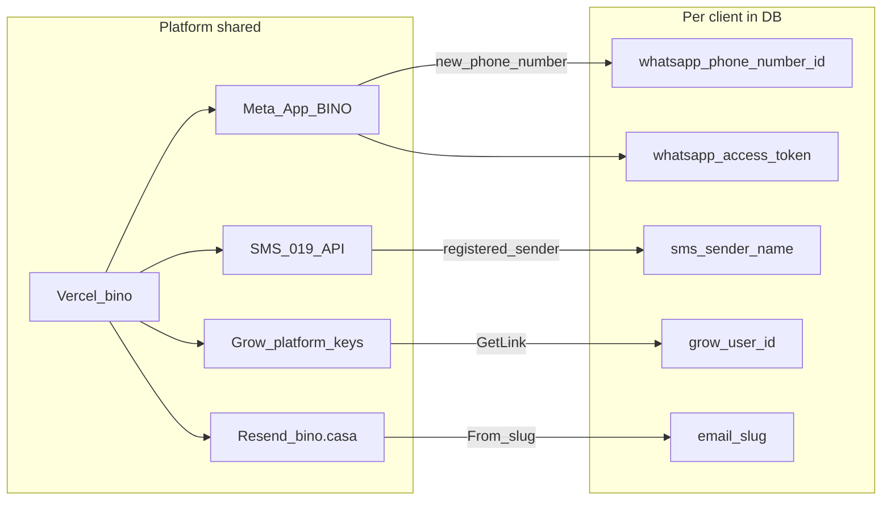

# הקמת לקוח חדש ב-BINO

**מודל:** פרויקט Vercel אחד · Meta App אחת · נתונים פר-לקוח ב-Supabase.

הסופר-אדמין → לקוח → **צ׳קליסט הקמה** מציג סטטוס חי. מסמך זה הוא המדריך התפעולי.

---

## מה משותף (פלטפורמה — פעם אחת ב-Vercel)

| משאב | איפה | הערה |
|------|------|------|
| אפליקציה | Vercel project `bino` | אין פרויקט פר-לקוח |
| Meta App | Meta Developer | Verify token + App secret משותפים |
| Webhook WhatsApp | `/api/webhook/whatsapp` | Meta מפנה לכתובת אחת; BINO מזהה לקוח לפי `phone_number_id` |
| 019SMS API | `SMS_019_USERNAME` / `PASSWORD` | חשבון API אחד |
| Grow platform | `GROW_API_KEY`, `GROW_X_API_KEY`, `GROW_PAGE_CODE`, `GROW_WEBHOOK_SECRET` | סליקה כפלטפורמה |
| Resend | `RESEND_API_KEY` + דומיין מאומת `bino.casa` | From פר-לקוח: `{slug}@bino.casa` |
| Push | `VAPID_*` | משותף |

אין צורך ב-environment variables חדשים ב-Vercel לכל לקוח.

---

## מה פר-לקוח (חוזר בכל השקה)

### 1. יצירת לקוח
- סופר-אדמין → אשף `/superadmin/setup` (או יצירה קיימת)
- מקבלים: `client_id`, הזמנת אדמין, בניינים/עובדים בסיסיים

### 2. WhatsApp (Meta App אחת)
1. ב-Meta Business של BINO — **Add phone number** למספר החדש של הלקוח
2. העתיקו **Phone Number ID** → סופר-אדמין → מנוי ומכסות / הגדרות לקוח
3. העתיקו **Access Token** → כניסה כלקוח → הגדרות → WhatsApp  
   (לא שמים את הטוקן ב-Vercel)

### 3. 019SMS — מספר שולח
1. רשמו אצל 019 מספר שולח ללקוח (`9725…`)
2. הדביקו בסופר-אדמין בשדה **מספר שולח 019SMS** (`sms_sender_name`)  
   **לא** שם כמו "Bino" — 019 דוחה אלפאנומרי

### 4. Grow — כסף של הלקוח
1. הפעילו תוסף **גבייה** (collections) אם רלוונטי
2. הגדרות לקוח → Grow: GetLink או הדבקת `userId`
3. מלאו פרטי עסק ל-`/vaad-pay/{clientId}` (שם, טלפון, כתובת)
4. הגדרת חשבוניות אוטומטיות — באתר העסקי של Grow (פעם ראשונה לחשבון)

### 5. מייל Resend ממותג
- סופר-אדמין → צ׳קליסט הקמה → **slug**  
  דוגמה: `Bamakor` → `Bamakor <bamakor@bino.casa>`  
  `סביון` → הגדירו ידנית `savion`
- אין צורך בכתובת חדשה ב-Vercel; הדומיין `bino.casa` כבר מאומת ב-Resend

### 6. תפעול בסיסי
- בניין אחד לפחות + דיירים
- עובד פעיל
- לוגו (מומלץ לדף תשלום)
- טלפון מנהל

### 7. בדיקות לפני השקה
- [ ] הודעת WhatsApp נכנסת ונוצרת תקלה תחת הלקוח הנכון
- [ ] SMS יוצא עם מספר השולח של הלקוח
- [ ] חיוב גבייה ₪1 → webhook → «שולם» (+ חשבונית אם הופעלה ב-Grow)
- [ ] מייל אישור מגיע מ-`{slug}@bino.casa`

---

## תרשים זרימה

---

## סיכום מהיר לסופר-אדמין

| שלב | פעולה |
|-----|--------|
| יצירה | אשף setup |
| צ׳קליסט | `#client/{id}/launch` |
| WA ID | מנוי ומכסות |
| WA token | הגדרות לקוח |
| SMS | מנוי ומכסות → 972… |
| Grow + legal | הגדרות לקוח → Grow |
| גבייה | תוספים בתשלום |
| מייל | צ׳קליסט → slug |
