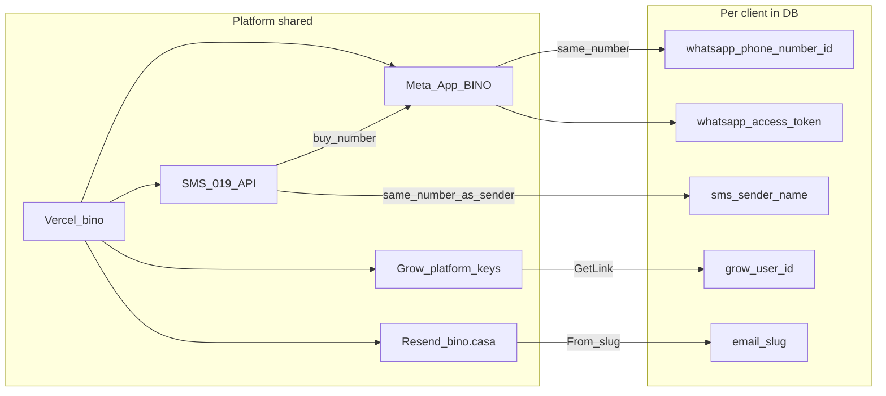

# הקמת לקוח חדש ב-BINO

**מודל:** פרויקט Vercel אחד · Meta App אחת · מספר 019 אחד = SMS + WhatsApp · נתונים פר-לקוח ב-Supabase.

בסופר-אדמין → לקוח → **צ׳קליסט הקמה** מופיע סדר הפעולה בזמן אמת + סטטוס חי.

---

## סדר פעולה בזמן אמת (אל תערבבו)

| # | פעולה | איפה |
|---|--------|------|
| 1 | צרו לקוח ב-BINO | סופר-אדמין → `/superadmin/setup` |
| 2 | קנו מספר ב-019 | 019 — מספר אחד בלבד |
| 3 | חברו את **אותו** מספר ב-Meta App של BINO | Meta → Add phone number → Phone Number ID + Token |
| 4 | הדביקו ב-BINO | `sms_sender` 972… + WA Phone Number ID + WA Access Token |
| 5 | Grow — שלחו ללקוח קישור רישום (GetLink) | תוסף גבייה → GetLink / userId → פרטי עסק ל-`/vaad-pay` |
| 6 | מייל Resend + סיום תפעולי | slug@bino.casa, לוגו, בניין/עובד/מנהל → בדיקות |

שלושת השלבים החיצוניים שחוזרים על עצמם: **019 → Meta → Grow GetLink**.  
מה שקל לפספס ביניהם: יצירת לקוח (1), הדבקה ב-BINO (4), פרטי עסק + slug + בדיקות (5–6).

---

## מה משותף (פלטפורמה — פעם אחת ב-Vercel)

| משאב | איפה | הערה |
|------|------|------|
| אפליקציה | Vercel project `bino` | אין פרויקט פר-לקוח |
| Meta App | Meta Developer | Verify token + App secret משותפים |
| Webhook WhatsApp | `/api/webhook/whatsapp` | כתובת אחת; זיהוי לקוח לפי `phone_number_id` |
| 019SMS API | `SMS_019_USERNAME` / `PASSWORD` | חשבון API אחד |
| Grow platform | `GROW_*` (+ GetLink: `GROW_REGISTER_*`) | סליקה כפלטפורמה |
| Resend | `RESEND_API_KEY` + דומיין `bino.casa` | From פר-לקוח: `{slug}@bino.casa` |
| Push | `VAPID_*` | משותף |

אין environment variables חדשים ב-Vercel לכל לקוח.

---

## פירוט פר-לקוח

### 1. יצירת לקוח
- סופר-אדמין → אשף `/superadmin/setup`
- מקבלים: `client_id`, הזמנת אדמין, בניין/עובד בסיסיים

### 2. קניית מספר ב-019
- מספר **אחד** — ישמש גם כשולח SMS וגם כ-WhatsApp
- עדיין לא מדביקים ב-BINO עד אחרי Meta (או מיד אחרי שיש מספר)

### 3. חיבור ב-Meta App של BINO
1. Meta Business של BINO — **Add phone number** (המספר מ-019)
2. העתיקו **Phone Number ID**
3. העתיקו **Access Token**

### 4. הדבקה ב-BINO
1. סופר-אדמין → מנוי ומכסות → **מספר שולח 019SMS** כ-`9725…` (לא שם מותג)
2. שם → **WA Phone Number ID**
3. כניסה כלקוח → הגדרות → WhatsApp → **Access Token** (לא ב-Vercel)

### 5. Grow
1. הפעילו תוסף **גבייה** אם הלקוח גובה דיירים
2. הגדרות לקוח → Grow: צרו/שלחו **GetLink**, או הדביקו `userId` אחרי הרשמה
3. מלאו פרטי עסק ל-`/vaad-pay/{clientId}` (שם, טלפון, כתובת)
4. חשבוניות אוטומטיות — הגדרה ראשונה באתר העסקי של Grow

### 6. מייל + תפעול + בדיקות
- סופר-אדמין → צ׳קליסט → **slug** (`Bamakor` → `bamakor@bino.casa`)
- בניין + עובד פעיל + טלפון מנהל + לוגו (מומלץ)

### 7. בדיקות חיות (חובה לפני soft launch)
מדריך מלא: [`docs/CLIENT_SOFT_LAUNCH_SMOKE.md`](./CLIENT_SOFT_LAUNCH_SMOKE.md)  
אוטומציה (mocks): `npm run test:e2e -- tests/e2e/client-soft-launch.spec.ts --project=chromium`

- [ ] WhatsApp נכנס → תקלה תחת הלקוח הנכון
- [ ] SMS יוצא עם מספר השולח של הלקוח
- [ ] חיוב גבייה ₪1 → webhook → «שולם»
- [ ] מייל מ-`{slug}@bino.casa`
- [ ] פורטל עובד / דייר (אם רלוונטי)

---

## תרשים זרימה

---

## סיכום מהיר

| שלב | פעולה |
|-----|--------|
| 1 | אשף setup |
| 2 | קניית מספר 019 |
| 3 | Meta App BINO — אותו מספר |
| 4 | הדבקת 972… + WA ID + token |
| 5 | GetLink + userId + פרטי עסק |
| 6 | slug + תפעול + בדיקות |
| צ׳קליסט | `#client/{id}/launch` |
