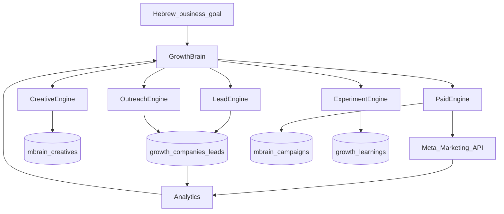

# GROWTH_SYSTEM_ARCHITECTURE.md

**Product objective:** Generate qualified demos and customers for Bamakor.  
**Not:** a generic AI marketing dashboard.  
**North star:** `qualified_demos / ₪ spent`

**Status:** Phase 0–3 + Phase 6 foundation shipped on branch; Phase 4–5 Meta path already in `mbrain`; Phase 7 supervised auto-pause partial via optimization rules. First Bamakor campaign pack is **draft-only** at `/brain/campaign-pack`.

---

## 1. Repository audit (current Bamakor)

### What exists
| Layer | Reality |
|-------|---------|
| Stack | Next.js 16 App Router, React 19, Supabase, Zod, Vitest, Vercel `fra1` |
| Bamakor SaaS | Tickets, projects, residents, workers, WhatsApp ops, SMS, collections, calendar — **preserve intact** |
| Tenant model | Bamakor: `organizations` → `clients`. Marketing: separate `mbrain_organizations` |
| CRM / sales leads | **None** for outbound. `residents` = product domain, not ICP |
| WhatsApp | Ticket/ops webhook + inbox. Optional Anthropic polish (`lib/whatsapp-ai.ts`). Not a growth channel yet |
| Levy Marketing Brain | `/brain/*` + `/api/mbrain/*` + migrations `093–097` |
| mbrain capabilities | Brand Brain, strategy (Zod), copy/templates, Meta OAuth + launch path, approvals, guardrails, insights cron, Hebrew Operator, daily digest |
| Meta default | `META_MODE=mock` until live credentials |

### Critical design decision
**Do not replace Bamakor SaaS.**  
**Do not recreate a second Meta/LLM stack.**  
**Growth OS = deepen Marketing Brain into a full growth machine**, adding outbound + experiments + learning, while paid Meta stays on the existing `lib/mbrain/meta/*` adapter.

UI stays under **`/brain`** (already Hebrew RTL command center). Internal modules live in `lib/growth/` + `lib/mbrain/`. New CRM tables use `growth_*` prefix to avoid collision with Bamakor and ad-ops `mbrain_*`.



---

## 2. Open-source reuse assessment

### A. [Abhipaddy8/outreach-agent](https://github.com/Abhipaddy8/outreach-agent)
| Field | Finding |
|-------|---------|
| Stars | ~17 |
| License | **No LICENSE file** → treat as **concepts only; do not copy code** |
| Stack | Claude Code markdown “skills”, Tavily, Prospeo/Apollo, Instantly, Gmail, Chrome LinkedIn |
| Reuse | Pipeline stages (research → enrich → verify → personalize → sequence → memory); mission queue idea; stop-on-reply |
| Do NOT reuse | LinkedIn browser automation; paid enrichment lock-in; markdown-as-runtime; any scrapers that bypass platform ToS |
| Security / policy | High risk if LinkedIn automation / unverified mass email |
| **Verdict** | **Adapt concepts into our TypeScript Lead + Outreach engines. Build ourselves.** |

### B. [DV0x/creative-ad-agent](https://github.com/DV0x/creative-ad-agent)
| Field | Finding |
|-------|---------|
| Stars | ~114 |
| License | **MIT** |
| Stack | Claude Agent SDK, fal.ai images, hook-methodology skill |
| Reuse | Hook-first methodology; diversity matrix (vary hook/pain/visual/CTA); brand research → factual hooks; 6-concept batching |
| Do NOT reuse | Full Claude Agent SDK runtime; fal.ai hard dependency; Cloudflare Workers agent host |
| **Verdict** | **Port hook formulas + diversity rules into `lib/growth/creative/` on top of existing mbrain copywriter/templates.** |

### C. [byadsco/meta-ads-mcp](https://github.com/byadsco/meta-ads-mcp)
| Field | Finding |
|-------|---------|
| Stars | ~12 (actively maintained, v3.x) |
| License | **MIT** |
| Stack | Standalone MCP server, Firestore tokens, 135 tools, rate-limit circuit breakers |
| Reuse | Insights guardrails patterns; rate-limit header parsing; circuit breaker; creative-media/leads tool shapes as reference |
| Do NOT reuse | Running a separate MCP+Firestore service in prod (ops cost + Frankenstein); replacing our Next.js Meta adapter wholesale |
| **Verdict** | **Do not deploy MCP as runtime dependency.** Keep/enhance `lib/mbrain/meta/*`. Cherry-pick compliance patterns (throttle, insights safety). Optional local MCP later for Cursor only. |

### D. [gomarble-ai/marketing-agent](https://github.com/gomarble-ai/marketing-agent)
| Field | Finding |
|-------|---------|
| Stars | ~8 |
| License | **MIT** (skills markdown) |
| Stack | Claude Code plugin + **GoMarble hosted MCP** (paid SaaS path) |
| Reuse | Meta creative-fatigue heuristics; daily optimization decision matrices; “no fabricated metrics” discipline; attribution discipline |
| Do NOT reuse | GoMarble OAuth/MCP subscription; Google/TikTok scope for Bamakor Phase 1–5 |
| **Verdict** | **Encode fatigue/audit matrices as TypeScript rules** (extend `lib/mbrain/optimization-rules.ts`). No GoMarble dependency. |

### Frankenstein rule
Integrating full MCP servers + Claude Code skill packs would add complexity and SaaS gravity without helping Bamakor ship demos. Prefer **small owned modules + concept ports**.

---

## 3. Proposed architecture

### Engines (logical modules under `lib/growth/` + `lib/mbrain/`)

| Engine | Responsibility | Build vs reuse |
|--------|----------------|----------------|
| **Growth Brain** | Goal → plan → experiments → tasks; orchestrates others | Extend `lib/mbrain/agents/operator.ts` + new `lib/growth/brain/` |
| **Lead Engine** | Discover/research/score Israeli PMCs | Build (outreach-agent concepts) |
| **Outreach Engine** | Personalized sequences, opt-out, stop rules | Build |
| **Creative Engine** | Hook-first concepts, copy, templates | Extend mbrain + creative-ad-agent concepts |
| **Paid Acquisition** | Meta campaigns under approvals | **Existing** `lib/mbrain/meta/*` + launch/approvals |
| **Experiment Engine** | Hypotheses, variants, winners | Build (`growth_experiments`) |
| **Analytics Engine** | Funnel to qualified demo/customer | Extend snapshots + `growth_conversions` |
| **Memory / Learning** | Structured learnings affecting future plans | Build (`growth_learnings`) |

### UI (Hebrew RTL) — extend `/brain`
| Section | Status |
|---------|--------|
| Overview / dashboard | Exists → add demo/qualified KPIs |
| Brands / strategy / creatives / campaigns / approvals | Exists (paid path) |
| AI Operator / Growth Brain chat | Exists → expand tools for leads/outreach/experiments |
| **Leads** | New |
| **Outreach** | New |
| **Experiments** | New |
| **Learnings** | New |
| Integrations / Guardrails | Exists |

### Autonomy modes (already seeded)
- MANUAL / **SUPERVISED (default)** / AUTONOMOUS  
- Map to: Read-only / Approval required / Limited auto  
- LLM never final spend authority (`mbrain_spending_guardrails`)

---

## 4. Database changes

### Keep & extend (`mbrain_*`)
Paid ads objects, creatives, Meta connections, approvals, performance snapshots, brand brain, agent runs.

### Add (`growth_*`) — Phase 1+
```
growth_companies          -- discovered PMC companies
growth_contacts           -- people at companies
growth_leads              -- scored pipeline entities (links company/contact)
growth_interactions       -- touches (email/whatsapp/call/task)
growth_sequences          -- outreach sequence definitions
growth_sequence_enrollments
growth_tasks              -- human/agent work queue
growth_experiments        -- structured tests
growth_experiment_arms
growth_conversions        -- demo_booked, customer (business metrics)
growth_learnings          -- structured memory
growth_goals              -- “10 demos this week”
growth_plans              -- approved Growth Brain plans
growth_suppressions       -- opt-out / do-not-contact
```

Link optionally: `growth_leads.mbrain_lead_id`, `growth_experiments.mbrain_campaign_id`.

Lead statuses align with strategy: `new | researched | qualified | contacted | replied | demo_booked | customer | disqualified | suppressed`.

Scoring: transparent points + `score_reasons[]` JSON (HOT ≥80, WARM 60–79, COLD &lt;60).

---

## 5. Integrations

| Integration | Approach | Cost |
|-------------|----------|------|
| Meta Marketing API | Existing adapter (+ throttle patterns from meta-ads-mcp) | Media spend only |
| LLM | `LLMProvider` local-first | ~0 preferred |
| Images | Template + optional generative | ~0 preferred |
| Lead discovery | Public web search / directories (legal); no LinkedIn bot | Prefer free/public |
| Email outreach | Resend (already in Bamakor ops) or SMTP later | Low |
| WhatsApp growth | Separate from ticket webhook; templates + consent | Meta conversation pricing |
| Enrichment APIs | Optional later; never fabricate | Avoid until needed |

---

## 6. Agent architecture (simple tools, not microservices)

Same process as today: Marketing/Growth Director orchestrates **typed tools** + Zod.

Tools examples:
- `createGrowthGoal`, `proposeGrowthPlan`, `approvePlan`
- `discoverCompanies`, `scoreLead`, `enrollSequence`
- `generateCreativeBatch`, `requestCampaignLaunch`
- `getFunnelMetrics`, `recordLearning`

Every action → `mbrain_agent_runs` / `growth_tasks` + audit.

---

## 7. Risks

| Risk | Mitigation |
|------|------------|
| Spam / platform bans | Opt-out, rate limits, approval, no LinkedIn automation |
| Fabricated leads/metrics | Never invent; store null + confidence |
| Uncontrolled Meta spend | Existing guardrails + SUPERVISED default |
| Frankenstein deps | No MCP runtime, no GoMarble, no license-less copy |
| Breaking Bamakor | Namespace isolation; no shared route takeover |
| Cost creep | COSTS.md; media spend is intended variable cost |

---

## 8. Staged implementation plan

| Phase | Deliverable | Depends on credentials? |
|-------|-------------|-------------------------|
| **0** | This doc + COSTS.md | No |
| **1** | `growth_*` schema + Lead scoring + Leads UI + Growth goal model + approvals | No |
| **2** | Outreach sequences + email draft/send + stop rules | Resend optional |
| **3** | Hook-first creative batching + diversity matrix | No |
| **4** | Meta insights polish + fatigue rules (paid read path) | Meta live preferred |
| **5** | Meta write already largely present — wire experiments to campaigns | Meta live |
| **6** | Experiment engine + conversions + learnings | No |
| **7** | Supervised auto-pause within guardrails | Meta live |
| **First campaign pack** | ICPs, angles, hooks, ads, sequences, budget — **draft only, no auto-launch** | After Phase 1–3 |

---

## 9. Files / modules that will change (near-term)

**New**
- `docs/GROWTH_SYSTEM_ARCHITECTURE.md` (this file)
- `docs/COSTS.md`
- `supabase/migrations/098_growth_foundation.sql`
- `lib/growth/**` (scoring, discovery stubs, brain plan schemas)
- `app/brain/leads/**`, `app/api/mbrain/growth/**` or `/api/growth/**`

**Extend**
- `lib/mbrain/agents/operator.ts` — growth tools
- `lib/mbrain/nav.ts` — Leads / Experiments / Learnings
- `app/brain/dashboard` — north-star KPIs
- `lib/mbrain/optimization-rules.ts` — fatigue matrices

**Do not touch**
- Bamakor ticket/WhatsApp core, `clients`, resident CRM, `/campaigns` broadcast

---

## 10. Dependencies to introduce

| Dependency | Why | Mandatory? |
|------------|-----|------------|
| (already) `sharp` | Meta creative rasterization | For live image upload |
| None new for Phase 1 | Pure TS + Supabase | — |
| Optional later: Resend | Outbound email | Only Phase 2 |
| Rejected: GoMarble, Apollo/Prospeo default, meta-ads-mcp server, Claude Agent SDK | Cost / lock-in / Frankenstein | No |

---

## 11. First Bamakor campaign (draft when Phase 1–3 ready)

Will produce for approval (not auto-launch):
- 3 ICP variants · 5 angles · 10 hooks · 6 Meta concepts · 3 outbound sequences · 2 offers · LP structure · experiment matrix · test budget · tracking · success criteria

Primary ICP hypothesis (unproven): Israeli multi-building property management decision makers.
